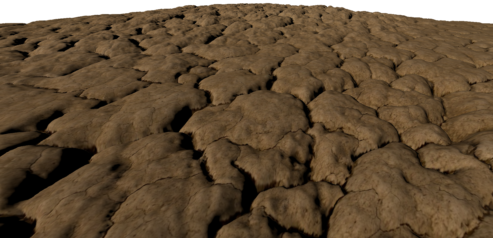
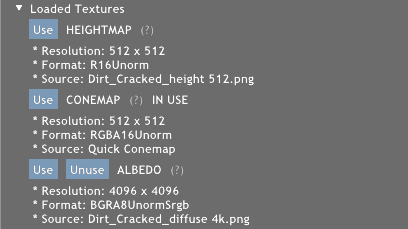
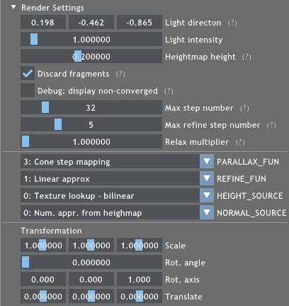
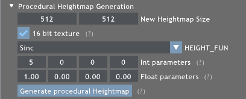
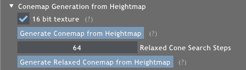
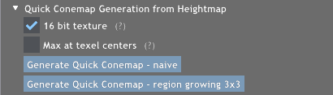
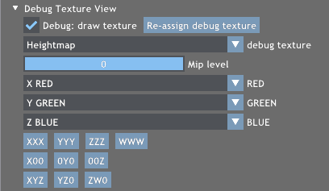

# Quick Cone Map Generation

## The Parallax Project



Our project was created in Falcor. You can find the Falcor 4.4 readme below ours. Our project is `Samples > Parallax`.

This project (https://github.com/Bundas102/falcor-conemap) contains the implementation for the Eurpgraphics 2022 Short Paper: *Quick cone map generation on the GPU*, G&aacute;bor Valasek and R&oacute;bert B&aacute;n, https://diglib.eg.org:443/handle/10.2312/egs20221021

Check out https://github.com/Bundas102/falcor-hermite-heightmap for our other project based on the same application for the Eurographics 2022 Poster: *Hermite interpolation of heightmaps*, R&oacute;bert B&aacute;n and G&aacute;bor Valasek, https://diglib.eg.org:443/handle/10.2312/egp20221017

## Building and running the project
- Open `Falcor.sln` with Visual Studio
- Change the Startup Project to `Samples > Parallax` in the Solution Explorer
- Build & Run &ndash; this will build the `Falcor` project as a dependency automatically

## Overview


- The project renders a single square (two triangles) and uses parallax mapping techniques to apply a height map to achieve a detailed surface.
- The program handles three textures: a height map, a cone map and, an albedo/diffuse texture.
Either the height map or the cone map is used at any time for parallax mapping.
- The height map can be loaded from an image file, or it can be generated procedurally from a height function.
- The cone map can be generated from the height map.

## Render Settings


Rendering is done by a primary search and then a refinement phase. See [Displacement Mapping on the GPU &mdash; State of the Art](https://doi.org/10.1111/j.1467-8659.2007.01108.x) for an overview.

The primary search is defined by `PARALLAX_FUN`:
- *0: Bump mapping* &ndash; no search
- *1: Parallax mapping* &ndash; a single parallax step
- *2: Linear search* &ndash; uniformly divide the ray interval into `Max step number` parts
- *3: Cone step mapping* &ndash; uses the cone map for space skipping

The refinement is defined by `REFINE_FUN`:
- *0: No refinement*
- *1: Linear approx* &ndash; assumes the surface is linear between the last two steps
- *2: Binary search* &ndash; halves the interval between the last two steps `Max refine step number` times

## Procedural height map generation


The generated heightmap is created from a height function defined in `ProceduralHeightmap.cs.slang`. Select the used function with `HEIGHT_FUN`.

The project contains two functions by default, but feel free to create your own:
1. Write the height function mapping [0,1]&sup2; texture coordinates to [0,1] height values &ndash; in `ProceduralHeightmap.cs.slang`
2. Extend the preprocessor switch with the new entry &ndash; in `ProceduralHeightmap.cs.slang`
3. Extend the GUI list `kHeightFunList` with the new function  &ndash; in `Parallax.cpp`

## Cone map generation


Create a cone map from the loaded height map. The cone map is selected for use upon generation, but the render method does not change automatically, so you might have to set `PARALLAX_FUN` in *Render Settings* to `3: Cone step mapping` to make use of the cone map.

## Quick cone map generation


Create a cone map form the loaded height map using the proposed quick generation algorithm. See our paper for details.

## Load image


Load a height map or an albedo texture from an image file. The height values are expected to be in the red channel of the texture.

## Debug view


The selected texture is rendered to the square using point (nearest neighbor) sampling. If the texture has multiple MIP levels, the desired level is selectable.

The `RED`, `GREEN` and `BLUE` settings are the channels of the rendered color. Some common presets are accessible through the buttons under the channel settings.

For cone maps the red channel contains the height values and the green channel has the cones (tangent of the half openening angle).

---
---
# Falcor 4.4

Falcor is a real-time rendering framework supporting DirectX 12. It aims to improve productivity of research and prototype projects.

Features include:
* Abstracting many common graphics operations, such as shader compilation, model loading, and scene rendering
* DirectX Raytracing abstraction
* Render Graph system
* Python scripting
* Common rendering effects such as shadows and post-processing effects
* Unbiased path tracer

The included path tracer requires NVAPI. Please make sure you have it set up properly, otherwise the path tracer won't work. You can find the instructions below.

## Prerequisites
- Windows 10 version 20H2 (October 2020 Update) or newer
- Visual Studio 2019
- [Windows 10 SDK (10.0.19041.0) for Windows 10, version 2004](https://developer.microsoft.com/en-us/windows/downloads/windows-10-sdk/)
- A GPU which supports DirectX Raytracing, such as the NVIDIA Titan V or GeForce RTX (make sure you have the latest driver)

Optional:
- Windows 10 Graphics Tools. To run DirectX 12 applications with the debug layer enabled, you must install this. There are two ways to install it:
    - Click the Windows button and type `Optional Features`, in the window that opens click `Add a feature` and select `Graphics Tools`.
    - Download an offline package from [here](https://docs.microsoft.com/en-us/windows-hardware/test/hlk/windows-hardware-lab-kit#supplemental-content-for-graphics-media-and-mean-time-between-failures-mtbf-tests). Choose a ZIP file that matches the OS version you are using (not the SDK version used for building Falcor). The ZIP includes a document which explains how to install the graphics tools.
- NVAPI (see below)

## NVAPI installation
After cloning the repository, head over to https://developer.nvidia.com/nvapi and download the latest version of NVAPI (this build is tested against version R440).
Extract the content of the zip file into `Source/Externals/.packman/` and rename `R470-developer` to `nvapi`.

Finally, set `_ENABLE_NVAPI` to `1` in `Source/Falcor/Core/FalcorConfig.h`

## CUDA Support
If you want to use CUDA C/C++ code as part of a Falcor project, then refer to the README located in the `Source/Samples/CudaInterop/` for instructions on how to set up your environment to use CUDA with Falcor.

If you want to execute Slang-based shader code through CUDA using `CUDAProgram`, then you will need to copy or link the root directory of the CUDA SDK under `Source/Externals/.packman/`, as a directory named `CUDA`.
Then, set `_ENABLE_CUDA` to `1` in `Source/Falcor/Core/FalcorConfig.h`

## OptiX Support
If you want to use Falcor's OptiX functionality (specifically the `OptiXDenoiser` render pass), then refer to the README location in `Source/Samples/OptixDenoiser` for instructions on setting up your environment to use OptiX with Falcor.

In particular, you will need to copy or link the root directory of the OptiX SDK under `Source/Externals/`, as a directory named `optix` (i.e., `Source/Externals/optix/include/optix.h` should exist).
Then, set `_ENABLE_OPTIX` to `1` in `Source/Falcor/Core/FalcorConfig.h`

## Falcor Configuration
`FalcorConfig.h` contains some flags which control Falcor's behavior.
- `_LOG_ENABLED` - Enable/disable log messages. By default, it is set to `1`.
- `_PROFILING_ENABLED` - Enable/Disable the internal CPU/GPU profiler. By default, it is set to `1`.

## Resources
- [Falcor](https://github.com/NVIDIAGameWorks/Falcor): Falcor's GitHub page.
- [Documentation](./Docs/index.md): Additional information and tutorials.
    - [Getting Started](./Docs/Getting-Started.md)
    - [Render Graph Tutorials](./Docs/Tutorials/index.md)
- [ORCA](https://developer.nvidia.com/orca): A collection of high quality scenes and assets optimized for Falcor.
- [Slang](https://github.com/shader-slang/slang): Falcor's shading language and compiler.

## Citation
If you use Falcor in a research project leading to a publication, please cite the project.
The BibTex entry is

```bibtex
@Misc{Kallweit21,
   author =      {Simon Kallweit and Petrik Clarberg and Craig Kolb and Kai-Hwa Yao and Theresa Foley and Lifan Wu and Lucy Chen and Tomas Akenine-Moller and Chris Wyman and Cyril Crassin and Nir Benty},
   title =       {The {Falcor} Rendering Framework},
   year =        {2021},
   month =       {08},
   url =         {https://github.com/NVIDIAGameWorks/Falcor},
   note =        {\url{https://github.com/NVIDIAGameWorks/Falcor}}
}
```
